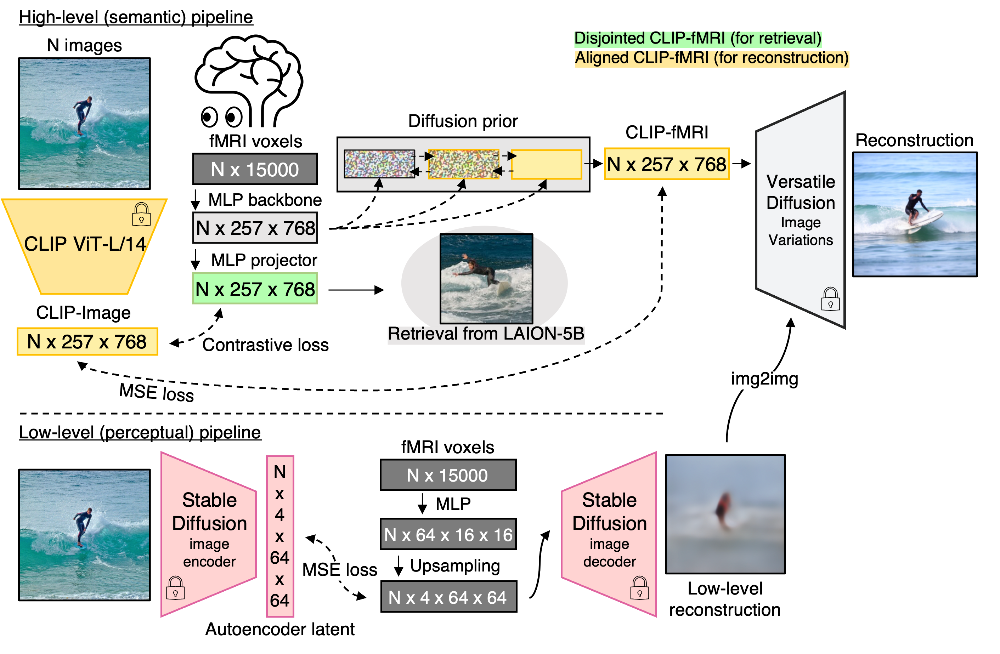

# MindEye fMRI-to-Image reconstruction & retrieval

<br>

## Installation instructions

1. Agree to the following [Terms and Conditions](https://cvnlab.slite.page/p/IB6BSeW_7o/Terms-and-Conditions) and fill out the [NSD Data Access form](https://forms.gle/xue2bCdM9LaFNMeb7). 

2. Download a copy of this repository via "git clone https://github.com/MedARC-AI/fMRI-reconstruction-NSD.git".

3. Create a conda environment that will run the notebooks and training scripts:

```bash
conda env create -f src/environment.yaml
conda activate medical-v1
```

4. (optional) For LAION-5B retrieval you will need to map to the last layer of CLIP ViT-L/14 (in addition to the last hidden layer, which is the standard MindEye pipeline). For training MindEye on just the last layer ("4 ResBlocks + Only CLS"), you will first need to cd into the "src" folder and run ``. download.sh``. This will allow you to train the diffusion prior starting from a pretrained checkpoint (text-to-image diffusion prior trained from LAION-Aesthetics). We observed that using this checkpoint, rather than training the prior from scratch, significantly improved results.

## General information

This repository contains Jupyter notebooks for 

1. Training MindEye (src/Train_MindEye.ipynb)
2. Reconstructing images from brain activity using the trained model (src/Reconstructions.ipynb)
3. Retrieving images from brain activity either from the test set or via LAION-5B (src/Retrieval_Evaluation.ipynb) 
4. Evaluating reconstructions against the ground truth images according to low- and high-level image metrics (src/Reconstruction_Metrics.ipynb) 

The Jupyter notebooks are configured such that they can be run interactively (.ipynb) or via command-line with argparse arguments (.py).

This repo also contains code for mapping brain activity to the variational autoencoder of Stable Diffusion (src/train_autoencoder.py).

### Pre-trained Subject 1 models

You can skip training MindEye yourself and instead run the rest of the notebooks on Subject 1 of NSD by downloading our pre-trained models available on [huggingface](https://huggingface.co/datasets/pscotti/naturalscenesdataset/tree/main/mindeye_models) and putting these folders containing model checkpoints inside "fMRI-reconstruction-NSD/train_logs/".

```
prior_257_final_subj01_bimixco_softclip_byol: CLIP ViT-L/14 hidden layer (257x768) 
prior_1x768_final_subj01_bimixco_softclip_byol: CLIP ViT-L/14 final layer (1x768)
autoencoder_subj01_4x_locont_no_reconst: Stable Diffusion VAE (low-level pipeline)
```

## Training MindEye (high-level pipeline)

Train MindEye via ``Train_MindEye.py``.

- Set ``data_path`` to the folder containing the Natural Scenes Dataset (will download there if not found; >30Gb per subject, only downloads data for the current subject).
- Set ``model_name`` to what you want to name the model, used for saving.
- Set ``--no-hidden --no-norm_embs`` if you want to map to the final layer of CLIP for LAION-5B retrieval purposes. Otherwise use the defaults ``--hidden --norm_embs``.

Various arguments can be set (see below) for training; the default is to train MindEye to the last hidden layer of CLIP ViT-L/14 using the same settings as our paper, for Subject 1 of NSD.

Trained model checkpoints will be saved inside a folder "fMRI-reconstruction-NSD/train_logs". All other outputs get saved inside "fMRI-reconstruction-NSD/src" folder.

```bash
$ python Train_MindEye.py --help
```
```
usage: Train_MindEye.py [-h] [--model_name MODEL_NAME] [--data_path DATA_PATH]
                        [--subj {1,2,5,7}] [--batch_size BATCH_SIZE]
                        [--hidden | --no-hidden]
                        [--clip_variant {RN50,ViT-L/14,ViT-B/32,RN50x64}]
                        [--wandb_log | --no-wandb_log]
                        [--resume_from_ckpt | --no-resume_from_ckpt]
                        [--wandb_project WANDB_PROJECT] [--mixup_pct MIXUP_PCT]
                        [--norm_embs | --no-norm_embs]
                        [--use_image_aug | --no-use_image_aug]
                        [--num_epochs NUM_EPOCHS] [--prior | --no-prior]
                        [--v2c | --no-v2c] [--plot_umap | --no-plot_umap]
                        [--lr_scheduler_type {cycle,linear}]
                        [--ckpt_saving | --no-ckpt_saving]
                        [--ckpt_interval CKPT_INTERVAL]
                        [--save_at_end | --no-save_at_end] [--seed SEED]
                        [--max_lr MAX_LR] [--n_samples_save N_SAMPLES_SAVE]
                        [--use_projector | --no-use_projector]
                        [--vd_cache_dir VD_CACHE_DIR]

Model Training Configuration

options:
  -h, --help            show this help message and exit
  --model_name MODEL_NAME
                        name of model, used for ckpt saving and wandb logging
  --data_path DATA_PATH
                        Path to where NSD data is stored (see README)
  --subj {1,2,5,7}
  --batch_size BATCH_SIZE
                        Batch size can be increased by 10x if only training v2c
                        and not diffusion prior
  --hidden, --no-hidden
                        if True, CLIP embeddings will come from last hidden
                        layer (e.g., 257x768 - Versatile Diffusion), rather than
                        final layer (default: True)
  --clip_variant {RN50,ViT-L/14,ViT-B/32,RN50x64}
                        clip variant
  --wandb_log, --no-wandb_log
                        whether to log to wandb (default: False)
  --resume_from_ckpt, --no-resume_from_ckpt
                        if not using wandb and want to resume from a ckpt
                        (default: False)
  --wandb_project WANDB_PROJECT
                        wandb project name
  --mixup_pct MIXUP_PCT
                        proportion of way through training when to switch from
                        InfoNCE to soft_clip_loss
  --norm_embs, --no-norm_embs
                        Do norming (using cls token if VD) of CLIP embeddings
                        (default: True)
  --use_image_aug, --no-use_image_aug
                        whether to use image augmentation (default: True)
  --num_epochs NUM_EPOCHS
                        number of epochs of training
  --prior, --no-prior   if False, only train via NCE loss (default: True)
  --v2c, --no-v2c       if False, only train via diffusion prior loss (default:
                        True)
  --plot_umap, --no-plot_umap
                        Plot UMAP plots alongside reconstructions (default:
                        False)
  --lr_scheduler_type {cycle,linear}
  --ckpt_saving, --no-ckpt_saving
  --ckpt_interval CKPT_INTERVAL
                        save backup ckpt and reconstruct every x epochs
  --save_at_end, --no-save_at_end
                        if True, saves best.ckpt at end of training. if False
                        and ckpt_saving==True, will save best.ckpt whenever
                        epoch shows best validation score (default: False)
  --seed SEED
  --max_lr MAX_LR
  --n_samples_save N_SAMPLES_SAVE
                        Number of reconstructions for monitoring progress, 0
                        will speed up training
  --use_projector, --no-use_projector
                        Additional MLP after the main MLP so model can
                        separately learn a way to minimize NCE from prior loss
                        (BYOL) (default: True)
  --vd_cache_dir VD_CACHE_DIR
                        Where is cached Versatile Diffusion model; if not cached
                        will download to this path
```

## Reconstructing from pre-trained MindEye

Now that you have pre-trained model ckpts in your "train_logs" folder, either from running ``Train_MindEye.py`` or by downloading our pre-trained Subject 1 models from [huggingface](https://huggingface.co/datasets/pscotti/naturalscenesdataset/tree/main/mindeye_models), we can proceed to reconstructing images from the test set of held-out brain activity. 

``Reconstructions.py`` defaults to outputting Versatile Diffusion reconstructions as a torch .pt file, without img2img and without second-order selection (recons_per_sample=1).

- Set ``data_path`` to the folder containing the Natural Scenes Dataset (will download there if not found; >30Gb per subject, only downloads data for the current subject).
- Set ``model_name`` to the name of the folder contained in "fMRI-reconstruction-NSD/train_logs" that contains the ckpt mapping brain activity to the last hidden layer of CLIP.
- If you want to use img2img, set ``autoencoder_name`` to the name of the folder contained in "fMRI-reconstruction-NSD/train_logs" that contains the ckpt mapping brain activity to the variational autoencoder of Stable Diffusion. 
- If you are using img2img, set ``img2img_strength`` to the level of guidance you prefer, where 1=no img2img and 0=outputs solely from the low-level pipeline.

```bash
$ python Reconstructions.py --help
```
```
usage: Reconstructions.py [-h] [--model_name MODEL_NAME]
                          [--autoencoder_name AUTOENCODER_NAME] [--data_path DATA_PATH]
                          [--subj {1,2,5,7}] [--img2img_strength IMG2IMG_STRENGTH]
                          [--recons_per_sample RECONS_PER_SAMPLE]
                          [--vd_cache_dir VD_CACHE_DIR]

Model Training Configuration

options:
  -h, --help            show this help message and exit
  --model_name MODEL_NAME
                        name of trained model
  --autoencoder_name AUTOENCODER_NAME
                        name of trained autoencoder model
  --data_path DATA_PATH
                        Path to where NSD data is stored (see README)
  --subj {1,2,5,7}
  --img2img_strength IMG2IMG_STRENGTH
                        How much img2img (1=no img2img; 0=outputting the low-level image
                        itself)
  --recons_per_sample RECONS_PER_SAMPLE
                        How many recons to output, to then automatically pick the best
                        one (MindEye uses 16)
  --vd_cache_dir VD_CACHE_DIR
                        Where is cached Versatile Diffusion model; if not cached will
                        download to this path
```

## Image/Brain Retrieval (inc. LAION-5B image retrieval)

To evaluate image/brain retrieval using the NSD test set then use the Jupyter notebook ``Retrieval_Evaluation.ipynb`` and follow the code blocks under the "Image/Brain Retrieval" heading.

Running ``Retrieval_Evaluation.py`` will retrieve the top 16 nearest neighbors in LAION-5B based on the MindEye variant where brain activity is mapped to the final layer of CLIP. This is followed by second-order selection where the 16 retrieved images are converted to CLIP last hidden layer embeddings and compared to the MindEye outputs from the core model where brain activity is mapped to the last hidden layer of CLIP. The highest CLIP similarity retrieved image will be chosen, with all top-1 retrievals saved to a torch .pt file.

- Set ``data_path`` to the folder containing the Natural Scenes Dataset (will download there if not found; >30Gb per subject, only downloads data for the current subject).
- Set ``model_name`` to the name of the folder contained in "fMRI-reconstruction-NSD/train_logs" that contains the ckpt mapping brain activity to the last hidden layer of CLIP.
- Set ``model_name2`` to the name of the folder contained in "fMRI-reconstruction-NSD/train_logs" that contains the ckpt mapping brain activity to the final layer of CLIP.

```bash
$ python Retrieval_Evaluation.py --help
```
```
usage: Retrieval_Evaluation.py [-h] [--model_name MODEL_NAME]
                               [--model_name2 MODEL_NAME2] [--data_path DATA_PATH]
                               [--subj {1,2,5,7}]

Model Training Configuration

options:
  -h, --help            show this help message and exit
  --model_name MODEL_NAME
                        name of 257x768 model, used for everything except LAION-5B
                        retrieval
  --model_name2 MODEL_NAME2
                        name of 1x768 model, used for LAION-5B retrieval
  --data_path DATA_PATH
                        Path to where NSD data is stored (see README)
  --subj {1,2,5,7}
```


## Evaluating Reconstructions

After you have saved a .pt file from running ``Reconstructions.py`` or ``Retrieval_Evaluation.py``, you can use ``Reconstruction_Metrics.py`` to evaluate reconstructed images using the same low- and high-level image metrics used in the paper.

- Set ``recon_path`` to the name of the file in "fMRI-reconstruction-NSD/src" that was output from ``Reconstructions.py`` (should be ```{model_name}_recons_img2img{img2img_strength}_{recons_per_sample}samples.pt```). 
- Alternatively, to evaluate LAION-5B retrievals, you can replace recon_path with the name of the .pt file output from ```Retrieval_Evaluation.py``` (should be ```{model_name}_laion_retrievals_top16.pt```).
- Set ``all_images_path`` to the all_images.pt file in "fMRI-reconstruction-NSD/src" that was output from either ``Reconstructions.py`` or ``Retrieval_Evaluation.py`` (should be ```all_images.pt```). 

```bash
$ python Reconstruction_Metrics.py --help
```
```
usage: Reconstruction_Metrics.py [-h] [--recon_path RECON_PATH]
                                 [--all_images_path ALL_IMAGES_PATH]

Model Training Configuration

options:
  -h, --help            show this help message and exit
  --recon_path RECON_PATH
                        path to reconstructed/retrieved outputs
  --all_images_path ALL_IMAGES_PATH
                        path to ground truth outputs
```

## Training MindEye (low-level pipeline)

Under construction (see train_autoencoder.py)

# Citation

If you make use of this work please cite both the MindEye paper and the Natural Scenes Dataset paper.

Scotti*, Banerjee*, Goode†, Shabalin, Nguyen, Cohen, Dempster, Verlinde, Yundler, Weisberg, Norman§, Abraham§. Reconstructing the Mind's Eye: fMRI-to-Image with Contrastive Learning and Diffusion Priors. arXiv (2023).

Allen, St-Yves, Wu, Breedlove, Prince, Dowdle, Nau, Caron, Pestilli, Charest, Hutchinson, Naselaris*, & Kay*. A massive 7T fMRI dataset to bridge cognitive neuroscience and artificial intelligence. Nature Neuroscience (2021).
